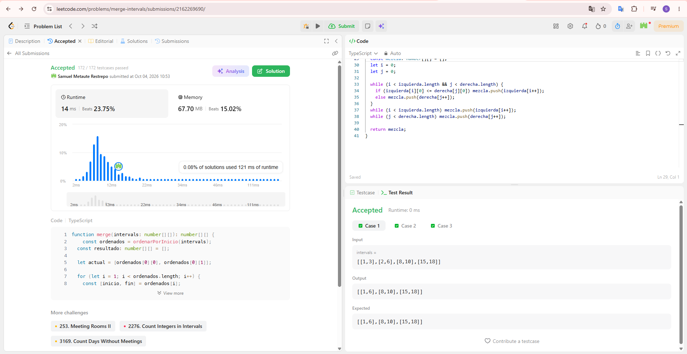
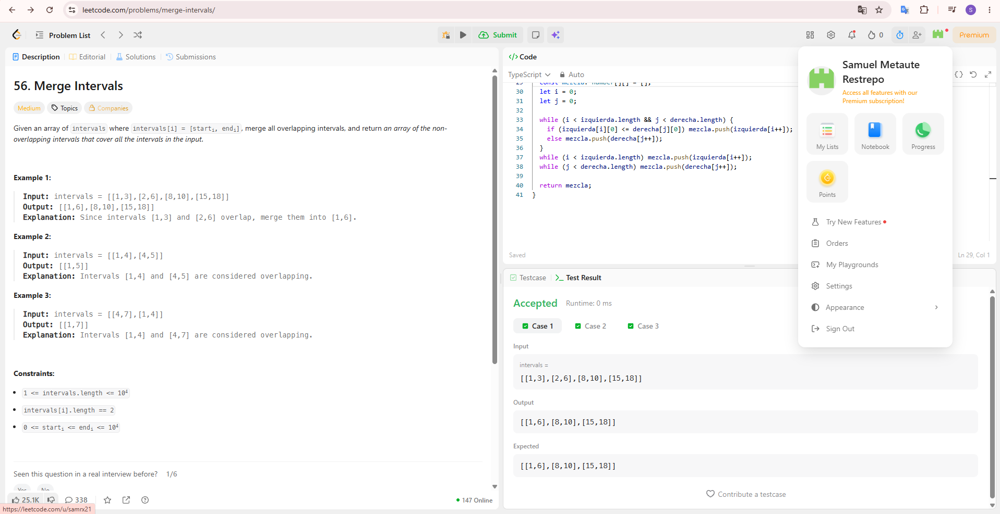
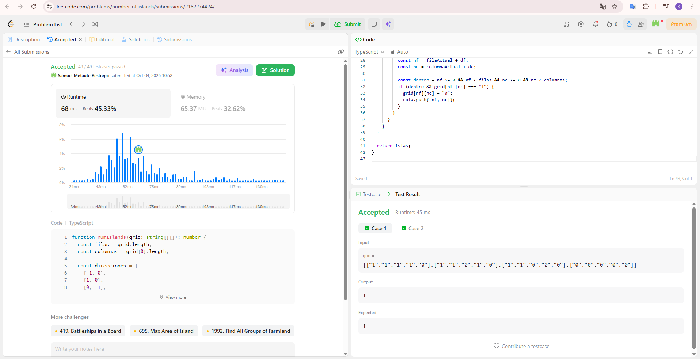
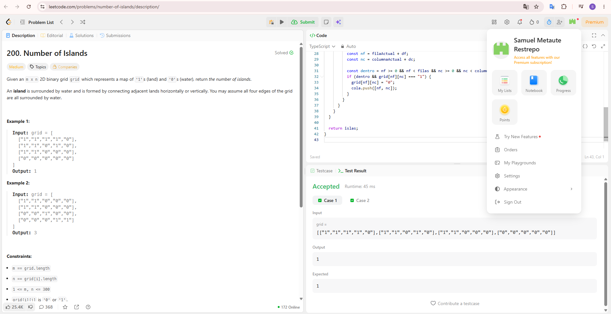
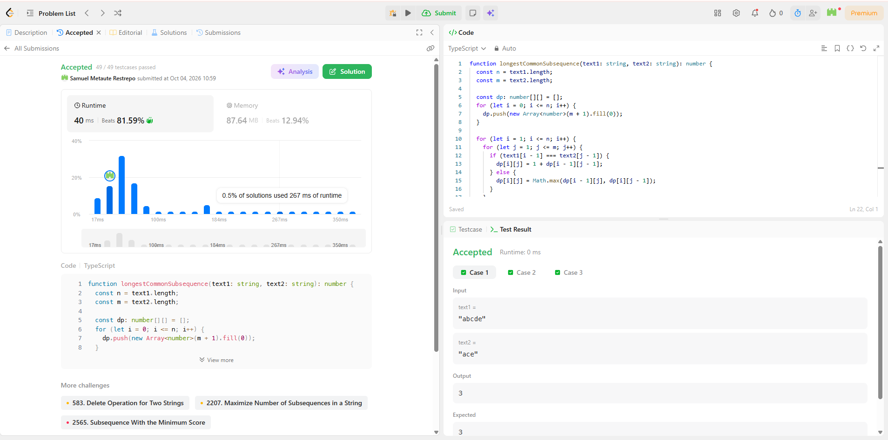
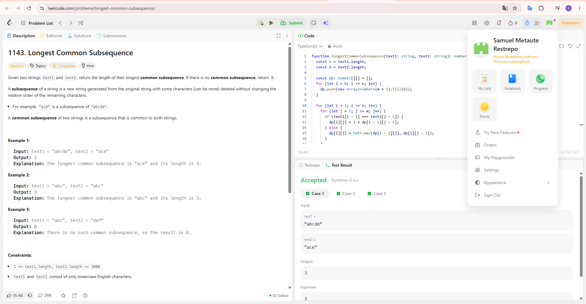
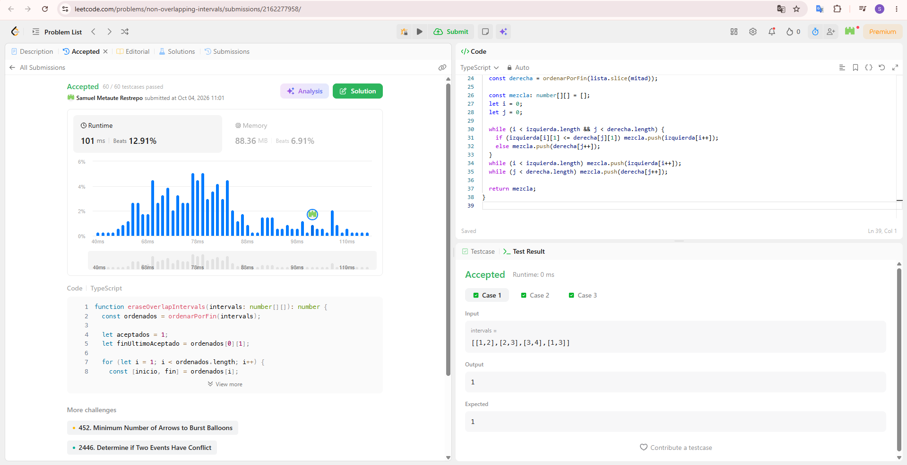
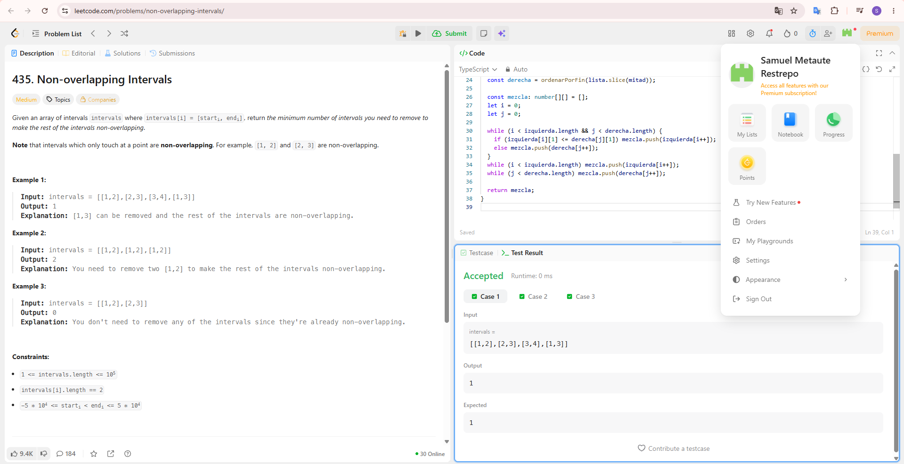
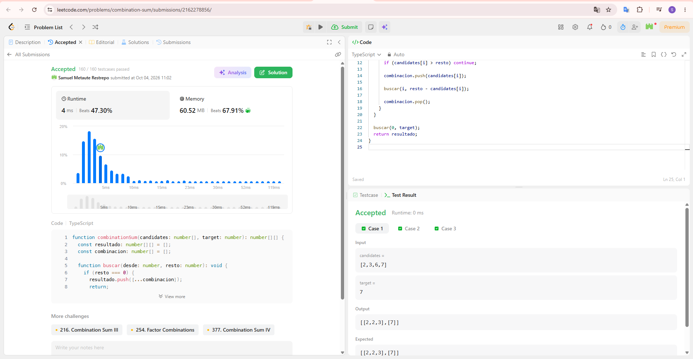
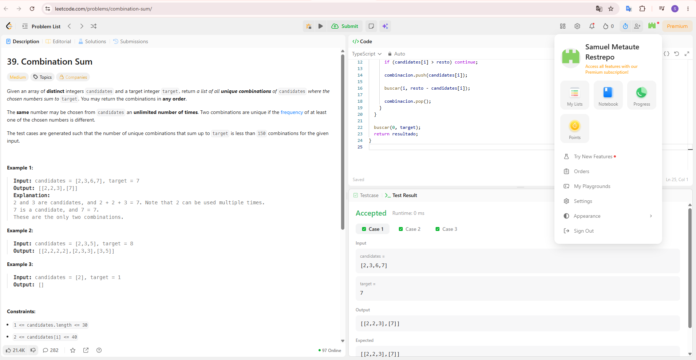

# Taller · Cinco familias en LeetCode

**Curso:** Análisis de algoritmos · ITM · 2026-2  
**Estudiante:** Samuel Metaute Restrepo  
**Usuario de LeetCode:** [samrx21](https://leetcode.com/u/samrx21/)  
**Lenguaje:** TypeScript

| # | Familia | Problema | Código | Tiempo | Espacio |
| --- | --- | --- | --- | --- | --- |
| 1 | Ordenamiento | [56. Merge Intervals](https://leetcode.com/problems/merge-intervals/) | [`merge-intervals.ts`](merge-intervals/merge-intervals.ts) | `O(n log n)` | `O(n)` |
| 2 | Grafos | [200. Number of Islands](https://leetcode.com/problems/number-of-islands/) | [`number-of-islands.ts`](number-of-islands/number-of-islands.ts) | `O(m · n)` | `O(m · n)` |
| 3 | Programación dinámica | [1143. Longest Common Subsequence](https://leetcode.com/problems/longest-common-subsequence/) | [`longest-common-subsequence.ts`](longest-common-subsequence/longest-common-subsequence.ts) | `O(n · m)` | `O(n · m)` |
| 4 | Greedy | [435. Non-overlapping Intervals](https://leetcode.com/problems/non-overlapping-intervals/) | [`non-overlapping-intervals.ts`](non-overlapping-intervals/non-overlapping-intervals.ts) | `O(n log n)` | `O(n)` |
| 5 | Backtracking | [39. Combination Sum](https://leetcode.com/problems/combination-sum/) | [`combination-sum.ts`](combination-sum/combination-sum.ts) | `O(n^(t/min))` | `O(t/min)` + salida |

---

## 56. Merge Intervals

**Enlace:** https://leetcode.com/problems/merge-intervals/  
**Familia:** ordenamiento  
**Código:** [`merge-intervals/merge-intervals.ts`](merge-intervals/merge-intervals.ts)

**Idea:** la clave de ordenamiento es el `start` de cada intervalo. Se ordenan los
intervalos con un merge sort propio y después una sola pasada de izquierda a derecha
los fusiona: se mantiene un intervalo "abierto" y, si el siguiente empieza antes o
justo cuando termina el abierto, se ensancha su `end`; si no, se cierra y se abre otro.

**Complejidad** (`n` = cantidad de intervalos):

- Tiempo: `O(n log n)`. Domina el merge sort; la pasada de fusión es `O(n)`.
- Espacio: `O(n)`, por el arreglo auxiliar del merge sort y por la salida.

**Evidencia:** Submit aceptado, 172 / 172 casos de prueba.

Enunciado, usuario de LeetCode y código:

---

## 200. Number of Islands

**Enlace:** https://leetcode.com/problems/number-of-islands/  
**Familia:** grafos  
**Código:** [`number-of-islands/number-of-islands.ts`](number-of-islands/number-of-islands.ts)

**Modelo:** el grafo está implícito en la grilla. Cada celda `'1'` es un vértice y hay
una arista entre dos celdas `'1'` vecinas por arriba, abajo, izquierda o derecha (no en
diagonal). El grafo es no dirigido. Una isla es una componente conexa.

**Idea:** se recorren todas las celdas. Cada vez que aparece un `'1'` sin visitar se
suma una isla y se lanza un BFS que recorre toda la componente y la "hunde" (la pasa a
`'0'`), para no contarla otra vez.

**Complejidad** (`m` = filas, `n` = columnas):

- Tiempo: `O(m · n)`. Cada celda entra a la cola a lo sumo una vez.
- Espacio: `O(m · n)` en el peor caso, por la cola del BFS.

**Evidencia:** Submit aceptado, 49 / 49 casos de prueba.

Enunciado, usuario de LeetCode y código:

---

## 1143. Longest Common Subsequence

**Enlace:** https://leetcode.com/problems/longest-common-subsequence/  
**Familia:** programación dinámica  
**Código:** [`longest-common-subsequence/longest-common-subsequence.ts`](longest-common-subsequence/longest-common-subsequence.ts)

**Estado:** `dp[i][j]` = longitud de la subsecuencia común más larga entre los primeros
`i` caracteres de `text1` y los primeros `j` caracteres de `text2`.

**Base:** `dp[0][j] = dp[i][0] = 0` (con un prefijo vacío no hay nada en común).

**Recurrencia:**

- si `text1[i-1] == text2[j-1]`: `dp[i][j] = 1 + dp[i-1][j-1]`
- si no: `dp[i][j] = max(dp[i-1][j], dp[i][j-1])`

La respuesta es `dp[n][m]`.

**Complejidad** (`n` = `text1.length`, `m` = `text2.length`):

- Tiempo: `O(n · m)`. Cada casilla de la tabla se llena una sola vez.
- Espacio: `O(n · m)`, por la tabla.

**Evidencia:** Submit aceptado, 49 / 49 casos de prueba.

Enunciado, usuario de LeetCode y código:

---

## 435. Non-overlapping Intervals

**Enlace:** https://leetcode.com/problems/non-overlapping-intervals/  
**Familia:** greedy  
**Código:** [`non-overlapping-intervals/non-overlapping-intervals.ts`](non-overlapping-intervals/non-overlapping-intervals.ts)

**Idea:** es la selección de actividades contada al revés. Minimizar cuántos intervalos
se borran es lo mismo que maximizar cuántos se quedan sin solaparse.

**Criterio greedy:** se ordenan los intervalos por su `end` (merge sort propio) y en
cada paso se acepta el siguiente intervalo que no pisa al último aceptado, es decir, el
que termina antes entre los que aún caben. Los que no se aceptan son los que se borran:
la respuesta es `n −` (cuántos se quedaron). Si un intervalo termina justo donde empieza
el otro, no se solapan.

**Complejidad** (`n` = cantidad de intervalos):

- Tiempo: `O(n log n)`. Domina el ordenamiento; la selección es `O(n)`.
- Espacio: `O(n)`, por el arreglo auxiliar del merge sort.

**Evidencia:** Submit aceptado, 60 / 60 casos de prueba.

Enunciado, usuario de LeetCode y código:

---

## 39. Combination Sum

**Enlace:** https://leetcode.com/problems/combination-sum/  
**Familia:** backtracking  
**Código:** [`combination-sum/combination-sum.ts`](combination-sum/combination-sum.ts)

**Qué se elige:** un candidato desde el índice actual en adelante. Se agrega a la
combinación y se baja con el resto reducido. El llamado siguiente sigue en el mismo
índice, porque un número se puede repetir; nunca se vuelve a índices menores, así no
salen permutaciones repetidas como `[2,2,3]` y `[2,3,2]`.

**Qué se deshace:** al volver de la recursión se quita el último candidato elegido (el
*backtrack*) y se prueba con el siguiente.

**Poda:** si un candidato es mayor que el resto, esa rama se pasaría del `target` y no
se explora. Cuando el resto llega a cero, se copia la combinación a la respuesta.

**Complejidad** (`n` = `candidates.length`, `t` = `target`, `min` = el candidato más
pequeño):

- Tiempo: `O(n^(t/min))` en el peor caso. El árbol de búsqueda tiene hasta `n` ramas por
  nivel y una profundidad máxima de `t/min`.
- Espacio: `O(t/min)` para la pila de recursión y la combinación actual, más el espacio
  de la salida.

**Evidencia:** Submit aceptado, 160 / 160 casos de prueba.

Enunciado, usuario de LeetCode y código:

